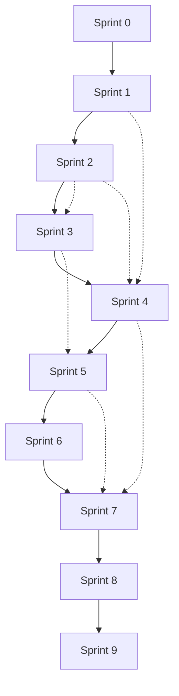

# Planning de Réalisation par Sprints - FleetMada

## Vue d'Ensemble du Projet

**FleetMada** est une application complète de gestion de flotte avec un frontend Next.js 14 déjà implémenté. Le projet nécessite le développement du backend avec PostgreSQL + Prisma via Docker pour rendre l'application pleinement fonctionnelle.

### Technologies Utilisées

| Composant | Technologies |
|-----------|-------------|
| **Frontend** | Next.js 14, React 18, TypeScript, TailwindCSS, Recharts |
| **Backend** | PostgreSQL, Prisma ORM, Docker |
| **Authentification** | JWT, bcrypt |
| **API** | REST API avec validation |
| **Déploiement** | Docker, Docker Compose |

---

## Sprint 0 - Infrastructure & Setup

### Objectifs
- Configurer l'environnement de développement backend
- Mettre en place l'infrastructure Docker avec PostgreSQL
- Initialiser Prisma ORM et la base de données
- Configurer Tailwind CSS avec les bonnes pratiques

### Durée Estimée
**5 jours ouvrés**

### Tâches Spécifiques

| Tâche | Description | Estimation | Status |
|-------|-------------|------------|--------|
| Setup Docker | ✅ docker-compose.yml avec PostgreSQL + Redis | 0.5 jour | ✅ Fait |
| Configuration Prisma | ✅ Schéma complet avec tous les modèles | 1 jour | ✅ Fait |
| Variables d'environnement | ✅ .env.example avec toutes les variables | 0.5 jour | ✅ Fait |
| Scripts de développement | ✅ Scripts npm pour docker/dev/setup | 0.5 jour | ✅ Fait |
| Configuration Tailwind | ✅ tailwind.config.js + postcss.config.js | 0.5 jour | ✅ Fait |
| Tests de connectivité | Vérifier la connexion DB/ORM | 1 jour | ⏳ À faire |
| Documentation setup | Guide d'installation développeur | 1 jour | ⏳ À faire |

### Configuration Technique Réalisée

#### 🐳 Docker Configuration
- **docker-compose.yml** : PostgreSQL 15 + Redis 7
- Variables d'environnement configurées
- Health checks automatiques
- Volumes persistants pour les données

#### 📊 Prisma ORM
- **prisma/schema.prisma** : Schéma complet avec 15+ modèles
- Relations définies entre toutes les entités
- Énumérations pour les statuts et types
- Compatible avec PostgreSQL

#### 🎨 Tailwind CSS
- **tailwind.config.js** : Configuration personnalisée
- Couleurs brand (primary, secondary, success, warning, danger)
- Animations et ombres personnalisées
- Police Inter configurée
- **postcss.config.js** : Plugin Tailwind + Autoprefixer

#### 📦 Package.json Mis à Jour
- Scripts Docker : `docker:up`, `docker:down`, `docker:logs`
- Scripts DB : `db:generate`, `db:migrate`, `db:reset`, `db:seed`
- Script setup automatique : `npm run setup`
- Dépendances backend ajoutées : Prisma, bcryptjs, jsonwebtoken, zod

### Critères d'Acceptation
- ✅ Docker Compose démarre PostgreSQL correctement
- ✅ Prisma génère le client TypeScript
- ✅ Tailwind CSS configuré et fonctionnel
- ✅ Scripts npm (dev, build, start) opérationnels
- ⏳ Connexion à la base de données à tester
- ⏳ Documentation d'installation à compléter

### Dépendances
- Docker et Docker Compose
- Node.js 18+
- npm ou yarn

---

## Sprint 1 - API Authentification & Utilisateurs

### Objectifs
- Développer l'API d'authentification complète
- Implémenter la gestion des utilisateurs
- Sécuriser les routes avec JWT

### Durée Estimée
**8 jours ouvrés**

### Tâches Spécifiques

| Tâche | Description | Estimation |
|-------|-------------|------------|
| Schéma User | Créer le modèle User dans Prisma | 1 jour |
| API Register | Endpoint POST /api/auth/register | 2 jours |
| API Login | Endpoint POST /api/auth/login | 2 jours |
| API Logout | Endpoint POST /api/auth/logout | 1 jour |
| Middleware Auth | Validation JWT pour les routes | 1.5 jours |
| API User Profile | CRUD complet pour le profil | 0.5 jour |

### Modèles de Données

```prisma
model User {
  id        String   @id @default(cuid())
  name      String
  email     String   @unique
  password  String
  companyName String
  avatar    String?
  createdAt DateTime @default(now())
  updatedAt DateTime @updatedAt
}
```

### Critères d'Acceptation
- ✅ Inscription utilisateur avec validation email unique
- ✅ Connexion avec JWT token (24h de validité)
- ✅ Déconnexion invalide le token
- ✅ Routes protégées par middleware d'authentification
- ✅ Gestion d'erreurs HTTP appropriées

---

## Sprint 2 - API Gestion des Véhicules

### Objectifs
- Développer l'API complète pour la gestion des véhicules
- Implémenter les fonctionnalités de base (CRUD)
- Gérer les assignations et historique des compteurs

### Durée Estimée
**10 jours ouvrés**

### Tâches Spécifiques

| Tâche | Description | Estimation |
|-------|-------------|------------|
| Schéma Vehicle | Modèles Vehicle, MeterEntry, Assignment | 2 jours |
| API Vehicles CRUD | CRUD complet pour les véhicules | 3 jours |
| API Meter History | Historique des compteurs | 2 jours |
| API Assignments | Assignation conducteurs/véhicules | 2 jours |
| API Replacement Analysis | Analyse de remplacement | 1 jour |

### Modèles de Données

```prisma
model Vehicle {
  id            String   @id @default(cuid())
  name          String
  vin           String   @unique
  type          String
  year          Int
  make          String
  model         String
  status        VehicleStatus
  image         String?
  meterReading  Float?
  createdAt     DateTime @default(now())
  updatedAt     DateTime @updatedAt
  
  meterEntries  MeterEntry[]
  assignments   VehicleAssignment[]
}

model MeterEntry {
  id        String   @id @default(cuid())
  vehicleId String
  vehicle   Vehicle  @relation(fields: [vehicleId], references: [id])
  date      DateTime
  value     Float
  type      MeterType
  void      Boolean  @default(false)
  source    String?
  createdAt DateTime @default(now())
}

model VehicleAssignment {
  id         String   @id @default(cuid())
  vehicleId  String
  vehicle    Vehicle  @relation(fields: [vehicleId], references: [id])
  operator   String
  startDate  DateTime
  endDate    DateTime?
  status     AssignmentStatus
  createdAt  DateTime @default(now())
}
```

### Critères d'Acceptation
- ✅ CRUD véhicules avec validation VIN unique
- ✅ Ajout d'entrées de compteur avec historique
- ✅ Assignation/désassignation de conducteurs
- ✅ Calcul automatique des statistiques de flotte
- ✅ API retourne les données dans le format attendu par le frontend

---

## Sprint 3 - API Gestion des Problèmes & Inspections

### Objectifs
- Développer l'API pour la gestion des problèmes (issues)
- Implémenter le système d'inspections avec formulaires dynamiques
- Gérer les commentaires et images

### Durée Estimée
**8 jours ouvrés**

### Tâches Spécifiques

| Tâche | Description | Estimation |
|-------|-------------|------------|
| Schéma Issues | Modèles Issue, Comment, IssueImage | 1.5 jours |
| API Issues CRUD | Gestion complète des problèmes | 2.5 jours |
| API Comments | Système de commentaires | 1.5 jours |
| API Images | Upload et gestion images | 1 jour |
| Schéma Inspections | Modèles InspectionForm, InspectionItem | 1.5 jours |

### Modèles de Données

```prisma
model Issue {
  id          String    @id @default(cuid())
  vehicleId   String?
  vehicle     Vehicle?  @relation(fields: [vehicleId], references: [id])
  summary     String
  status      IssueStatus
  priority    Priority
  reportedDate DateTime @default(now())
  assignedTo  String?
  labels      String[]
  watchers    Int       @default(0)
  comments    Comment[]
  images      IssueImage[]
  createdAt   DateTime  @default(now())
  updatedAt   DateTime  @updatedAt
}

model InspectionForm {
  id           String          @id @default(cuid())
  title        String
  vehicleCount Int             @default(0)
  items        InspectionItem[]
  createdAt    DateTime        @default(now())
  updatedAt    DateTime        @updatedAt
}
```

### Critères d'Acceptation
- ✅ CRUD problèmes avec statuts et priorités
- ✅ Système de commentaires fonctionnel
- ✅ Upload d'images pour les problèmes
- ✅ Création de formulaires d'inspection dynamiques
- ✅ Validation des types d'items d'inspection

---

## Sprint 4 - API Service & Entretien

### Objectifs
- Développer l'API complète pour la gestion de l'entretien
- Implémenter les programmes de service et rappels
- Gérer les ordres de travail et pièces

### Durée Estimée
**12 jours ouvrés**

### Tâches Spécifiques

| Tâche | Description | Estimation |
|-------|-------------|------------|
| Schéma Service | Modèles ServiceEntry, ServiceTask, Part | 3 jours |
| API Service Entries | CRUD entrées de service | 2.5 jours |
| API Service Tasks | Gestion des tâches de service | 2.5 jours |
| API Parts | Gestion des pièces détachées | 2 jours |
| API Work Orders | Ordres de travail | 2 jours |

### Modèles de Données

```prisma
model ServiceEntry {
  id        String         @id @default(cuid())
  vehicleId String
  vehicle   Vehicle        @relation(fields: [vehicleId], references: [id])
  date      DateTime
  status    ServiceStatus
  tasks     ServiceTaskEntry[]
  totalCost Float
  meter     Float?
  vendor    String?
  createdAt DateTime       @default(now())
  updatedAt DateTime       @updatedAt
}

model ServiceTask {
  id                String   @id @default(cuid())
  name              String
  description       String?
  entryCount        Int      @default(0)
  reminderCount     Int      @default(0)
  programCount      Int      @default(0)
  woCount           Int      @default(0)
  categoryCode      String?
  systemCode        String?
  assemblyCode      String?
  createdAt         DateTime @default(now())
  updatedAt         DateTime @updatedAt
}

model Part {
  id            String   @id @default(cuid())
  number        String   @unique
  description   String
  category      String?
  manufacturer  String?
  cost          Float?
  quantity      Int      @default(0)
  createdAt     DateTime @default(now())
  updatedAt     DateTime @updatedAt
}
```

### Critères d'Acceptation
- ✅ CRUD entrées de service avec calcul de coûts
- ✅ Gestion des tâches de service avec codes
- ✅ Inventaire des pièces avec suivi des quantités
- ✅ Ordres de travail avec statuts
- ✅ Calculs automatiques des statistiques

---

## Sprint 5 - API Rappels & Contacts

### Objectifs
- Développer l'API pour les rappels d'entretien
- Implémenter la gestion des contacts et fournisseurs
- Gérer les renouvellements de véhicules

### Durée Estimée
**8 jours ouvrés**

### Tâches Spécifiques

| Tâche | Description | Estimation |
|-------|-------------|------------|
| Schéma Reminders | Modèles ServiceReminder, VehicleRenewal | 2 jours |
| API Reminders | CRUD et notifications | 2.5 jours |
| API Contacts | Gestion des contacts | 2 jours |
| API Vendors | Gestion des fournisseurs | 1.5 jours |

### Modèles de Données

```prisma
model ServiceReminder {
  id          String        @id @default(cuid())
  vehicleId   String
  vehicle     Vehicle       @relation(fields: [vehicleId], references: [id])
  task        String
  status      ReminderStatus
  nextDue     DateTime
  compliance  Float         @default(0)
  createdAt   DateTime      @default(now())
  updatedAt   DateTime      @updatedAt
}

model Contact {
  id             String      @id @default(cuid())
  firstName      String
  lastName       String
  email          String      @unique
  phone          String?
  group          String?
  status         ContactStatus
  userType       String?
  classifications String[]
  image          String?
  jobTitle       String?
  createdAt      DateTime    @default(now())
  updatedAt      DateTime    @updatedAt
}

model Vendor {
  id             String      @id @default(cuid())
  name           String      @unique
  phone          String?
  website        String?
  address        String?
  contactName    String?
  labels         String[]
  classification String[]
  createdAt      DateTime    @default(now())
  updatedAt      DateTime    @updatedAt
}
```

### Critères d'Acceptation
- ✅ Rappels avec calculs de conformité
- ✅ Notifications automatiques pour rappels dus
- ✅ CRUD contacts avec classifications
- ✅ Gestion fournisseurs avec labels
- ✅ Suivi des renouvellements de véhicules

---

## Sprint 6 - API Carburant & Documents

### Objectifs
- Développer l'API pour la gestion du carburant et énergie
- Implémenter le système de documents
- Gérer les lieux et géorepérage

### Durée Estimée
**8 jours ouvrés**

### Tâches Spécifiques

| Tâche | Description | Estimation |
|-------|-------------|------------|
| Schéma Fuel | Modèles FuelEntry, ChargingEntry | 2 jours |
| API Fuel Entries | Gestion carburant et recharge | 2.5 jours |
| API Documents | Upload et gestion documents | 2 jours |
| API Places | Gestion des lieux et géorepérage | 1.5 jours |

### Modèles de Données

```prisma
model FuelEntry {
  id       String  @id @default(cuid())
  vehicleId String
  vehicle  Vehicle @relation(fields: [vehicleId], references: [id])
  date     DateTime
  vendor   String?
  usage    Float?
  volume   Float
  cost     Float
  mpg      Float?
  createdAt DateTime @default(now())
}

model Document {
  id          String   @id @default(cuid())
  fileName    String
  fileSize    String
  location    String?
  autoDelete  Boolean  @default(false)
  attachedTo  String?
  labels      String[]
  createdAt   DateTime @default(now())
  updatedAt   DateTime @updatedAt
}

model Place {
  id               String   @id @default(cuid())
  name             String
  description      String?
  address          String?
  geofenceRadius   Float?
  createdAt        DateTime @default(now())
  updatedAt        DateTime @updatedAt
}
```

### Critères d'Acceptation
- ✅ Calculs automatiques MPG et statistiques carburant
- ✅ Upload de documents avec métadonnées
- ✅ Système de labels pour les documents
- ✅ Géorepérage pour les lieux
- ✅ Historique complet des transactions

---

## Sprint 7 - API Rapports & Analytics

### Objectifs
- Développer l'API pour la génération de rapports
- Implémenter les analytics et statistiques
- Créer les endpoints pour les graphiques

### Durée Estimée
**6 jours ouvrés**

### Tâches Spécifiques

| Tâche | Description | Estimation |
|-------|-------------|------------|
| API Reports | CRUD et génération rapports | 2.5 jours |
| API Analytics | Statistiques et métriques | 2 jours |
| API Dashboard | Données pour le tableau de bord | 1.5 jours |

### Modèles de Données

```prisma
model Report {
  id          String      @id @default(cuid())
  title       String
  description String
  category    ReportCategory
  isFavorite  Boolean     @default(false)
  config      Json        // Configuration du rapport
  createdAt   DateTime    @default(now())
  updatedAt   DateTime    @updatedAt
}
```

### Critères d'Acceptation
- ✅ Rapports configurables par catégorie
- ✅ Métriques de performance calculées
- ✅ Données pour graphiques Recharts
- ✅ Statistiques de conformité et coûts
- ✅ Export des données (CSV/JSON)

---

## Sprint 8 - Tests & Optimisation

### Objectifs
- Implémenter les tests unitaires et d'intégration
- Optimiser les performances des requêtes
- Valider l'intégration frontend-backend

### Durée Estimée
**8 jours ouvrés**

### Tâches Spécifiques

| Tâche | Description | Estimation |
|-------|-------------|------------|
| Tests Unitaires | Jest + tests pour chaque API | 3 jours |
| Tests Integration | Tests end-to-end avec Supertest | 2 jours |
| Optimisation DB | Index et requêtes optimisées | 2 jours |
| Validation Frontend | Tests de l'intégration | 1 jour |

### Critères d'Acceptation
- ✅ Couverture de tests > 80%
- ✅ Toutes les APIs testées et validées
- ✅ Performance des requêtes optimisée
- ✅ Intégration frontend-backend fonctionnelle
- ✅ Documentation des APIs (Swagger)

---

## Sprint 9 - Déploiement & Mise en Production

### Objectifs
- Préparer l'environnement de production
- Configurer Docker pour le déploiement
- Migration des données et go-live

### Durée Estimée
**5 jours ouvrés**

### Tâches Spécifiques

| Tâche | Description | Estimation |
|-------|-------------|------------|
| Docker Production | Dockerfile et compose production | 2 jours |
| Migration DB | Scripts de migration et seeding | 1.5 jours |
| Configuration Prod | Variables et settings production | 1 jour |
| Documentation Prod | Guide de déploiement | 0.5 jour |

### Critères d'Acceptation
- ✅ Docker compose production fonctionnel
- ✅ Migration des données sans perte
- ✅ Variables d'environnement sécurisées
- ✅ Monitoring et logs configurés
- ✅ Documentation de déploiement complète

---

## Dépendances Entre Sprints



---

## Résumé des Sprints

| Sprint | Nom | Durée | Jours Total |
|--------|-----|-------|-------------|
| 0 | Infrastructure & Setup | 5 jours | 5 |
| 1 | Authentification & Utilisateurs | 8 jours | 13 |
| 2 | Gestion des Véhicules | 10 jours | 23 |
| 3 | Problèmes & Inspections | 8 jours | 31 |
| 4 | Service & Entretien | 12 jours | 43 |
| 5 | Rappels & Contacts | 8 jours | 51 |
| 6 | Carburant & Documents | 8 jours | 59 |
| 7 | Rapports & Analytics | 6 jours | 65 |
| 8 | Tests & Optimisation | 8 jours | 73 |
| 9 | Déploiement & Production | 5 jours | **78 jours** |

**Durée totale estimée :** 78 jours ouvrés (~16 semaines)

---

## Technologies et Outils de Développement

### Backend Stack
- **Database**: PostgreSQL 15+ avec Docker
- **ORM**: Prisma avec migrations automatiques
- **API**: REST avec Express.js (Next.js API Routes)
- **Auth**: JWT avec refresh tokens
- **Validation**: Zod pour la validation des données
- **Upload**: Multer pour les fichiers

### Outils de Test
- **Tests Unitaires**: Jest + React Testing Library
- **Tests API**: Supertest pour les endpoints
- **Coverage**: Istanbul/nyc pour la couverture

### DevOps
- **Containerisation**: Docker + Docker Compose
- **CI/CD**: GitHub Actions (optionnel)
- **Monitoring**: Logs structurés avec Winston

---

## Notes Importantes

### Points d'Attention
1. **Validation des données** : Utiliser Zod pour une validation robuste
2. **Sécurité** : JWT avec expiration, hash bcrypt pour les mots de passe
3. **Performance** : Index sur les champs fréquemment requête
4. **Backup** : Stratégie de sauvegarde automatique des données

### Évolutions Futures
- API GraphQL pour des requêtes plus complexes
- Notifications en temps réel avec WebSockets
- Intégrations ELD et télématiques
- Application mobile React Native
- Analytics avancés avec Machine Learning

---

*Document créé le : 14 Décembre 2024*
*Dernière mise à jour : 14 Décembre 2024*